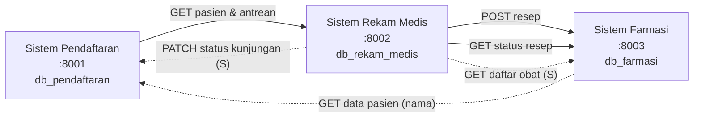
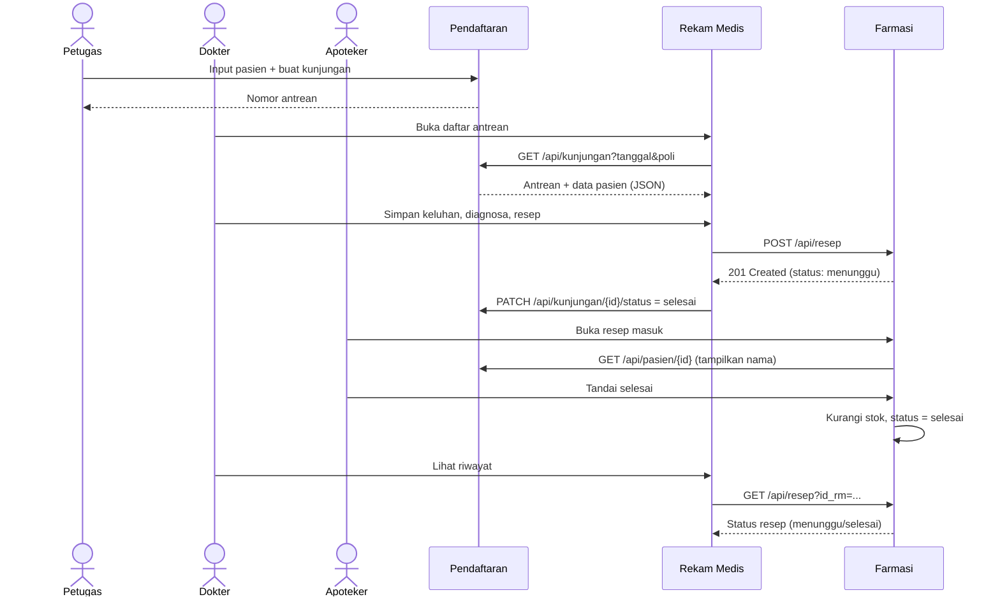
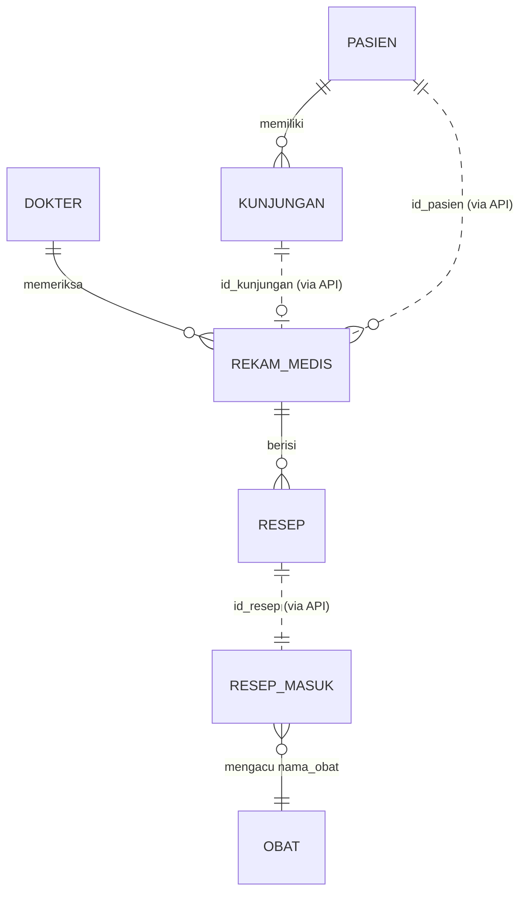

# PRD — Mini Hospital EAI

**Integrasi Sistem Pendaftaran, Rekam Medis, dan Farmasi Berbasis REST API**

| Item | Isi |
| --- | --- |
| Jenis | Tugas kelas Enterprise Application Integration (kelompok 4 orang) |
| Versi PRD | 1.0 |
| Stack | PHP 8.2 native (tanpa framework), MySQL 8, Apache, Docker Compose |
| Gaya integrasi | Point-to-point REST API, JSON, synchronous request–response |
| Sumber requirement | Dokumen `Mini_Hospital_EAI.docx` (studi kasus) |

---

## 0. Instruksi untuk AI Agent (BACA DULU)

Kamu adalah engineer yang mengimplementasikan PRD ini secara lengkap. Ikuti aturan berikut:

1. Bangun **tiga aplikasi PHP native yang berdiri sendiri** (Pendaftaran, Rekam Medis, Farmasi) di dalam **satu folder induk (monorepo)**, dijalankan lewat **satu `docker-compose.yml`**.
2. **Jangan memakai framework** (Laravel, Symfony, Slim, dsb.). Boleh memakai library front-end lewat CDN (Bootstrap 5). Tidak perlu Composer; gunakan autoloader `spl_autoload_register` sendiri.
3. Setiap aplikasi **punya database sendiri** dan **tidak boleh** query langsung ke database aplikasi lain. Semua pertukaran data lewat REST API.
4. Total tabel harus **7** (2 + 3 + 2). Penambahan *kolom* diperbolehkan hanya sesuai Bagian 6 (Penyesuaian). Jangan menambah tabel baru.
5. Kerjakan berurutan sesuai **Bagian 14 (Fase Implementasi)**. Setelah tiap fase, pastikan `docker compose up --build` tetap berjalan.
6. Semua dokumentasi di **Bagian 13** wajib dibuat sebagai file nyata di repo.
7. Bila ada hal yang ambigu, ikuti PRD ini. Bila PRD bertentangan dengan logika sistem, ambil keputusan paling sederhana dan **catat di `docs/DECISIONS.md`**.
8. Kode harus bisa dijalankan tanpa langkah manual selain `cp .env.example .env` dan `docker compose up --build`.

---

## 1. Latar Belakang & Masalah

Di mini hospital, bagian pendaftaran, poli (dokter), dan farmasi memakai aplikasi terpisah.

| # | Masalah | Dampak |
| --- | --- | --- |
| P1 | Data pasien diinput berulang di pendaftaran dan poli | Lambat, rawan salah ketik |
| P2 | Dokter tidak bisa langsung melihat data pasien dan antrean | Harus tanya ulang / cek manual |
| P3 | Resep berupa kertas | Bisa hilang, tulisan sulit dibaca, farmasi menunggu pasien datang |
| P4 | Data antar bagian tidak konsisten (nama, nomor RM) | Salah identifikasi pasien dan obat |

## 2. Tujuan & Metrik Keberhasilan

| Tujuan | Metrik / bukti |
| --- | --- |
| Data pasien cukup diinput sekali | Aplikasi Rekam Medis **tidak punya form input pasien**; semua data pasien diambil via `GET` dari Pendaftaran |
| Resep digital langsung masuk farmasi | Resep dokter muncul di Farmasi ≤ 2 detik setelah disimpan, tanpa input ulang |
| Dokter melihat antrean real-time | Daftar antrean di Poli = data Pendaftaran saat itu |
| Data konsisten | Nama obat di resep divalidasi terhadap master obat Farmasi; nomor RM hanya dibuat di Pendaftaran |
| Ketiga app terintegrasi & bisa didemokan | Skenario end-to-end Bagian 12 lulus 100% |

## 3. Ruang Lingkup

**In scope**
- 3 aplikasi web (UI server-rendered PHP) + REST API JSON untuk integrasi
- 3 database MySQL terpisah, 7 tabel, seed data
- Docker Compose (semua service satu perintah)
- Dokumentasi teknis lengkap (Bagian 13)

**Out of scope**
- Login/autentikasi pengguna UI, manajemen role (tidak ada tabel `users`; dokumen hanya mendefinisikan 7 tabel)
- Billing/pembayaran, rawat inap, laboratorium, BPJS
- Message broker, API gateway (dibahas hanya sebagai saran pengembangan di dokumentasi)

## 4. Pengguna & Aplikasi

| Aplikasi | Pengguna | Fungsi | Port host | Nama service Docker |
| --- | --- | --- | --- | --- |
| Sistem Pendaftaran | Petugas pendaftaran | Daftarkan pasien, buat kunjungan/antrean | 8001 | `pendaftaran` |
| Sistem Rekam Medis (Poli) | Dokter | Lihat antrean & data pasien, catat diagnosa, buat resep | 8002 | `rekam-medis` |
| Sistem Farmasi | Apoteker | Terima resep, siapkan obat, ubah status | 8003 | `farmasi` |

## 5. Arsitektur

### 5.1 Diagram konteks



### 5.2 Prinsip arsitektur
- **Database per aplikasi**: kepemilikan data jelas, tiap app dapat di-deploy mandiri.
- **Sumber kebenaran (system of record)**: data pasien & kunjungan → Pendaftaran; rekam medis & resep asli → Rekam Medis; stok obat & status penyiapan → Farmasi.
- **Server-to-server**: pemanggilan API antar aplikasi dilakukan dari backend PHP (cURL), **bukan dari JavaScript browser**, sehingga tidak perlu CORS.
- **Antar-container memakai nama service** (`http://pendaftaran`, `http://farmasi`), bukan `localhost`.
- **Kontrak API adalah satu-satunya jalur integrasi**; data pasien tidak disalin permanen ke database lain kecuali id sebagai referensi.

### 5.3 Sequence diagram alur utama



## 6. Penyesuaian terhadap Dokumen Requirement

Dokumen sumber hanya menyebut `GET` dan `POST`. Agar sistem benar-benar bisa berjalan, ada celah kecil yang ditutup di PRD ini. **Semua penyesuaian ini harus dicatat di `docs/DECISIONS.md`** dan dijelaskan di laporan.

| # | Celah di dokumen | Penyesuaian | Prioritas |
| --- | --- | --- | --- |
| A1 | Apoteker harus mengubah status "selesai", tapi tidak ada endpoint update | Tambah `PATCH /api/resep/{id_resep}/status` di Farmasi | **Wajib (M)** |
| A2 | `resep_masuk` tidak menyimpan dosis & aturan pakai, padahal apoteker butuh untuk etiket | Tambah kolom `dosis`, `aturan_pakai` di `resep_masuk` | **Wajib (M)** |
| A3 | Satu rekam medis bisa punya banyak obat; tabel resep 1 baris = 1 obat, sehingga tidak ada cara mengelompokkan | Tambah kolom `id_rm` dan `tgl_masuk` di `resep_masuk` | **Wajib (M)** |
| A4 | Farmasi hanya menyimpan `id_pasien`, tidak punya nama pasien | Farmasi memanggil `GET /api/pasien/{id}` ke Pendaftaran untuk menampilkan nama (fallback: "Pasien #id") | **Wajib (M)** |
| A5 | Nama obat berpotensi tidak konsisten (masalah P4) | Tambah `GET /api/obat` di Farmasi; Rekam Medis memakai dropdown dari sana; Farmasi menolak nama obat yang tidak ada di master (422) | Sebaiknya (S) |
| A6 | Status kunjungan tidak pernah berubah setelah diperiksa | Tambah `PATCH /api/kunjungan/{id}/status` di Pendaftaran, dipanggil Rekam Medis setelah rekam medis disimpan | Sebaiknya (S) |

> Prioritas: **M** = must, **S** = should. Kalau waktu mepet, A5 dan A6 boleh dikerjakan terakhir; sistem tetap utuh tanpa keduanya.

## 7. Rancangan Database

Semua tabel: engine InnoDB, charset `utf8mb4`, collation `utf8mb4_unicode_ci`. Timezone `Asia/Jakarta`.

### 7.1 `db_pendaftaran` (2 tabel)

```sql
CREATE TABLE pasien (
  id_pasien     INT UNSIGNED AUTO_INCREMENT PRIMARY KEY,
  no_rm         VARCHAR(20)  NOT NULL UNIQUE,          -- format RM-000001, dibuat otomatis
  nama          VARCHAR(100) NOT NULL,
  tgl_lahir     DATE         NOT NULL,
  jenis_kelamin ENUM('L','P') NOT NULL,
  alamat        VARCHAR(255) NOT NULL,
  no_hp         VARCHAR(20)  NULL,
  created_at    TIMESTAMP DEFAULT CURRENT_TIMESTAMP
) ENGINE=InnoDB;

CREATE TABLE kunjungan (
  id_kunjungan  INT UNSIGNED AUTO_INCREMENT PRIMARY KEY,
  id_pasien     INT UNSIGNED NOT NULL,
  tgl_kunjungan DATE         NOT NULL,
  poli          VARCHAR(50)  NOT NULL,                  -- Umum, Gigi, Anak
  no_antrean    INT UNSIGNED NOT NULL,                  -- reset per poli per tanggal, mulai 1
  status        ENUM('menunggu','selesai') NOT NULL DEFAULT 'menunggu',
  created_at    TIMESTAMP DEFAULT CURRENT_TIMESTAMP,
  CONSTRAINT fk_kunjungan_pasien FOREIGN KEY (id_pasien) REFERENCES pasien(id_pasien),
  UNIQUE KEY uq_antrean (tgl_kunjungan, poli, no_antrean),
  KEY idx_kunjungan_filter (tgl_kunjungan, poli, status)
) ENGINE=InnoDB;
```

### 7.2 `db_rekam_medis` (3 tabel)

```sql
CREATE TABLE dokter (
  id_dokter    INT UNSIGNED AUTO_INCREMENT PRIMARY KEY,
  nama_dokter  VARCHAR(100) NOT NULL,
  spesialis    VARCHAR(50)  NOT NULL
) ENGINE=InnoDB;

CREATE TABLE rekam_medis (
  id_rm         INT UNSIGNED AUTO_INCREMENT PRIMARY KEY,
  id_kunjungan  INT UNSIGNED NOT NULL UNIQUE,           -- 1 kunjungan = 1 rekam medis (ref. lintas DB, tanpa FK)
  id_pasien     INT UNSIGNED NOT NULL,                  -- ref. lintas DB, tanpa FK
  id_dokter     INT UNSIGNED NOT NULL,
  keluhan       TEXT NOT NULL,
  diagnosa      TEXT NOT NULL,
  tgl_periksa   DATETIME NOT NULL DEFAULT CURRENT_TIMESTAMP,
  CONSTRAINT fk_rm_dokter FOREIGN KEY (id_dokter) REFERENCES dokter(id_dokter),
  KEY idx_rm_pasien (id_pasien)
) ENGINE=InnoDB;

CREATE TABLE resep (                                    -- 1 baris = 1 item obat
  id_resep      INT UNSIGNED AUTO_INCREMENT PRIMARY KEY,
  id_rm         INT UNSIGNED NOT NULL,
  nama_obat     VARCHAR(100) NOT NULL,
  dosis         VARCHAR(50)  NOT NULL,
  jumlah        INT UNSIGNED NOT NULL,
  aturan_pakai  VARCHAR(100) NOT NULL,
  CONSTRAINT fk_resep_rm FOREIGN KEY (id_rm) REFERENCES rekam_medis(id_rm) ON DELETE CASCADE
) ENGINE=InnoDB;
```

### 7.3 `db_farmasi` (2 tabel)

```sql
CREATE TABLE obat (
  id_obat    INT UNSIGNED AUTO_INCREMENT PRIMARY KEY,
  nama_obat  VARCHAR(100) NOT NULL UNIQUE,
  stok       INT UNSIGNED NOT NULL DEFAULT 0,
  harga      DECIMAL(12,2) NOT NULL DEFAULT 0
) ENGINE=InnoDB;

CREATE TABLE resep_masuk (                              -- 1 baris = 1 item obat dari 1 resep
  id_resep_masuk INT UNSIGNED AUTO_INCREMENT PRIMARY KEY,
  id_resep       INT UNSIGNED NOT NULL UNIQUE,          -- id dari tabel resep di Rekam Medis (idempotensi)
  id_rm          INT UNSIGNED NOT NULL,                 -- [A3] pengelompokan per rekam medis
  id_pasien      INT UNSIGNED NOT NULL,
  nama_obat      VARCHAR(100) NOT NULL,
  dosis          VARCHAR(50)  NOT NULL,                 -- [A2]
  jumlah         INT UNSIGNED NOT NULL,
  aturan_pakai   VARCHAR(100) NOT NULL,                 -- [A2]
  status         ENUM('menunggu','selesai') NOT NULL DEFAULT 'menunggu',
  tgl_masuk      DATETIME NOT NULL DEFAULT CURRENT_TIMESTAMP,   -- [A3]
  tgl_selesai    DATETIME NULL,
  KEY idx_rm (id_rm),
  KEY idx_status (status)
) ENGINE=InnoDB;
```

### 7.4 ERD & relasi lintas database



Garis putus-putus = referensi **lintas database** (tanpa foreign key; nilai didapat dari respons API, bukan input ulang).

### 7.5 Seed data (wajib, agar demo langsung jalan)
- `db_pendaftaran`: 5 pasien (nama Indonesia realistis, `no_rm` RM-000001..5), 3 kunjungan hari ini (poli Umum ×2, Gigi ×1). Gunakan `CURDATE()`.
- `db_rekam_medis`: 3 dokter (Umum, Gigi, Anak).
- `db_farmasi`: 10 obat (mis. Paracetamol 500 mg, Amoxicillin 500 mg, Cetirizine 10 mg, Ibuprofen 400 mg, Antasida, Vitamin C, Ambroxol, Omeprazole, ORS, Chlorhexidine), stok 20–200.

## 8. Spesifikasi API

### 8.1 Konvensi umum
- Base URL antar-container: `http://pendaftaran/api`, `http://farmasi/api`. Dari host: `http://localhost:8001/api`, `http://localhost:8003/api`.
- Header wajib untuk semua `/api/*` kecuali `/api/health`: `X-API-KEY: <API_KEY dari .env>`. Salah/kosong → `401`.
- `Content-Type: application/json` untuk body request dan response.
- Format sukses:
  ```json
  { "status": "success", "message": "OK", "data": { } }
  ```
- Format gagal:
  ```json
  { "status": "error", "message": "Validasi gagal", "errors": { "jumlah": "Harus angka > 0" } }
  ```
- Kode HTTP: `200` OK, `201` Created, `400` request salah, `401` API key salah, `404` tidak ditemukan, `409` konflik (duplikat / transisi tidak valid / stok kurang), `422` validasi gagal, `500` error server, `502/503` layanan lain tidak tersedia.
- Tanggal: `YYYY-MM-DD`; datetime: `YYYY-MM-DD HH:MM:SS`.
- Timeout pemanggilan antar-app: connect 2 detik, total 5 detik.

### 8.2 Sistem Pendaftaran (port 8001)

| Method | Path | Fungsi | Dipanggil oleh |
| --- | --- | --- | --- |
| GET | `/api/health` | Cek hidup | semua |
| GET | `/api/kunjungan?tanggal=&poli=&status=` | Daftar antrean + data pasien | Rekam Medis |
| GET | `/api/kunjungan/{id_kunjungan}` | Satu kunjungan + pasien | Rekam Medis |
| GET | `/api/pasien/{id_pasien}` | Data satu pasien | Rekam Medis, Farmasi |
| PATCH | `/api/kunjungan/{id_kunjungan}/status` | Ubah status kunjungan **(A6)** | Rekam Medis |

`GET /api/kunjungan` — `tanggal` default hari ini, urut `no_antrean`. Contoh respons:

```json
{
  "status": "success",
  "message": "OK",
  "data": [
    {
      "id_kunjungan": 1,
      "tgl_kunjungan": "2026-09-28",
      "poli": "Umum",
      "no_antrean": 1,
      "status": "menunggu",
      "pasien": {
        "id_pasien": 3,
        "no_rm": "RM-000003",
        "nama": "Siti Aminah",
        "tgl_lahir": "1995-04-12",
        "jenis_kelamin": "P",
        "alamat": "Jl. Sudirman No. 10, Palembang",
        "no_hp": "081234567890"
      }
    }
  ]
}
```

`PATCH /api/kunjungan/{id}/status` — body `{ "status": "selesai" }`. Hanya `menunggu → selesai`; selain itu `409`.

### 8.3 Sistem Farmasi (port 8003)

| Method | Path | Fungsi | Dipanggil oleh |
| --- | --- | --- | --- |
| GET | `/api/health` | Cek hidup | semua |
| POST | `/api/resep` | Terima resep dari dokter | Rekam Medis |
| GET | `/api/resep?id_rm=` | Status semua item resep suatu rekam medis | Rekam Medis |
| GET | `/api/resep/{id_resep}` | Status satu item resep | Rekam Medis |
| PATCH | `/api/resep/{id_resep}/status` | Ubah status **(A1)** | UI Farmasi / uji manual |
| GET | `/api/obat?q=` | Daftar obat (id, nama, stok) **(A5)** | Rekam Medis |

`POST /api/resep` — request:

```json
{
  "id_rm": 12,
  "id_pasien": 3,
  "items": [
    { "id_resep": 21, "nama_obat": "Paracetamol 500 mg", "dosis": "500 mg", "jumlah": 10, "aturan_pakai": "3x1 sesudah makan" },
    { "id_resep": 22, "nama_obat": "Cetirizine 10 mg",  "dosis": "10 mg",  "jumlah": 5,  "aturan_pakai": "1x1 malam hari" }
  ]
}
```

Respons `201`:

```json
{
  "status": "success",
  "message": "Resep diterima",
  "data": {
    "id_rm": 12,
    "items": [
      { "id_resep_masuk": 1, "id_resep": 21, "status": "menunggu" },
      { "id_resep_masuk": 2, "id_resep": 22, "status": "menunggu" }
    ]
  }
}
```

Aturan:
- Seluruh item disimpan dalam **satu transaksi** (semua berhasil atau semua gagal).
- `id_resep` sudah pernah masuk → `409` (idempotensi, mencegah duplikat saat kirim ulang).
- `nama_obat` tidak ada di tabel `obat` → `422` **(A5)**. Jika A5 belum dikerjakan, lewati validasi ini.
- `jumlah` harus integer > 0; `items` tidak boleh kosong.

`GET /api/resep/{id_resep}` — respons `data`: `{ id_resep, id_rm, nama_obat, jumlah, status, tgl_masuk, tgl_selesai }`. Tidak ada → `404` (Rekam Medis menganggap ini "belum terkirim").

`PATCH /api/resep/{id_resep}/status` — body `{ "status": "selesai" }`:
- Hanya `menunggu → selesai`; selain itu `409`.
- Dalam satu transaksi: kunci baris obat (`SELECT ... FOR UPDATE`), cek `stok >= jumlah`, kurangi stok, set `status='selesai'` dan `tgl_selesai=NOW()`.
- Stok kurang → `409` dengan pesan `Stok tidak mencukupi` dan status **tidak berubah**.

### 8.4 Sistem Rekam Medis (port 8002)
Hanya menyediakan `GET /api/health` (JSON). Semua fungsi lain lewat UI. Aplikasi ini adalah **konsumen** API Pendaftaran dan Farmasi.

## 9. Kebutuhan Fungsional (User Stories)

Prioritas: M = must, S = should.

### 9.1 Pendaftaran
| ID | Sebagai | Saya ingin | Prioritas |
| --- | --- | --- | --- |
| FR-PD-01 | Petugas | mendaftarkan pasien baru (no_rm dibuat otomatis, format `RM-` + 6 digit) | M |
| FR-PD-02 | Petugas | mencari pasien berdasarkan nama / no_rm | M |
| FR-PD-03 | Petugas | mengubah data pasien | S |
| FR-PD-04 | Petugas | membuat kunjungan untuk pasien di suatu poli dan mendapat nomor antrean otomatis | M |
| FR-PD-05 | Petugas | melihat daftar antrean hari ini per poli beserta statusnya | M |
| FR-PD-06 | Sistem | menyediakan endpoint pada Bagian 8.2 | M |

Aturan bisnis: `no_antrean` naik 1 per poli per tanggal (mulai 1). Pasien tidak boleh punya kunjungan `menunggu` di poli dan tanggal yang sama (`409`/pesan error di UI). Pembuatan `no_rm` dan `no_antrean` harus aman dari race condition (gunakan transaksi + `UNIQUE`).

### 9.2 Rekam Medis
| ID | Sebagai | Saya ingin | Prioritas |
| --- | --- | --- | --- |
| FR-RM-01 | Dokter | melihat daftar antrean hari ini (filter poli, tanggal) yang diambil dari Pendaftaran | M |
| FR-RM-02 | Dokter | membuka pasien dari antrean dan melihat data pasien tanpa input ulang | M |
| FR-RM-03 | Dokter | mencatat keluhan dan diagnosa, memilih dokter pemeriksa | M |
| FR-RM-04 | Dokter | menambah 1..n item obat pada resep (nama dari dropdown master obat, dosis, jumlah, aturan pakai) | M |
| FR-RM-05 | Dokter | menyimpan pemeriksaan → rekam medis + resep tersimpan, resep terkirim ke Farmasi | M |
| FR-RM-06 | Dokter | melihat status tiap item resep (menunggu / selesai / belum terkirim) | M |
| FR-RM-07 | Dokter | mengirim ulang resep yang gagal terkirim | M |
| FR-RM-08 | Dokter | melihat riwayat rekam medis seorang pasien | S |
| FR-RM-09 | Sistem | setelah tersimpan, mengubah status kunjungan menjadi `selesai` di Pendaftaran | S (A6) |

Aturan bisnis:
- Satu kunjungan hanya boleh punya satu rekam medis (`409` bila diulang).
- **Tidak ada form input/edit data pasien** di aplikasi ini.
- Bila Pendaftaran tidak dapat dihubungi: tampilkan pesan ramah (mis. "Sistem Pendaftaran tidak dapat dihubungi, coba lagi"), jangan crash.
- Bila Farmasi gagal saat `POST /api/resep`: rekam medis dan resep lokal **tetap tersimpan**; UI menampilkan status **"Belum terkirim"** dengan tombol **Kirim ulang**. Status "belum terkirim" ditentukan dari `GET /api/resep/{id_resep}` yang mengembalikan `404`. Kirim ulang aman karena Farmasi idempoten (`409` untuk `id_resep` yang sudah ada dianggap sukses).

### 9.3 Farmasi
| ID | Sebagai | Saya ingin | Prioritas |
| --- | --- | --- | --- |
| FR-FA-01 | Apoteker | melihat daftar resep masuk, dikelompokkan per rekam medis, filter status | M |
| FR-FA-02 | Apoteker | melihat detail resep: nama pasien, obat, dosis, jumlah, aturan pakai | M |
| FR-FA-03 | Apoteker | menandai resep selesai (stok berkurang otomatis, ditolak jika stok kurang) | M |
| FR-FA-04 | Apoteker | melihat dan mengelola master obat (tambah, ubah stok/harga) | M |
| FR-FA-05 | Sistem | menampilkan peringatan stok rendah (< 10) | S |
| FR-FA-06 | Sistem | menyediakan endpoint pada Bagian 8.3 | M |

## 10. Kebutuhan Non-Fungsional

| Aspek | Ketentuan |
| --- | --- |
| Keamanan | PDO prepared statement di semua query; output HTML di-escape (`htmlspecialchars`); token CSRF di semua form `POST`; validasi input server-side; API key untuk `/api/*`; jangan pernah menampilkan stack trace ke pengguna |
| Error handling | Satu error/exception handler terpusat per aplikasi; API selalu membalas JSON dengan format Bagian 8.1; tidak ada `catch` kosong |
| Logging | Log request API dan error ke `stderr` (terlihat di `docker compose logs`) |
| Ketahanan | Timeout HTTP antar-app 5 detik; kegagalan satu app tidak menjatuhkan app lain |
| Konsistensi data | Transaksi untuk operasi multi-tabel; `UNIQUE` constraint untuk mencegah duplikat |
| Portabilitas | Seluruh konfigurasi lewat `.env`; tidak ada path/host hard-coded |
| Kinerja | Halaman utama < 1 detik untuk data seed; index pada kolom filter |
| UI | Bootstrap 5 via CDN, responsif, bahasa Indonesia, pesan sukses/gagal jelas |
| Kode | PHP 8.2, `declare(strict_types=1);`, PSR-12 secukupnya, namespace per folder |

## 11. Struktur Repository & Docker

### 11.1 Struktur folder

```
mini-hospital/
├── docker-compose.yml
├── .env.example
├── .gitignore
├── README.md
├── docs/
│   ├── ARCHITECTURE.md
│   ├── API.md
│   ├── DATABASE.md
│   ├── EAI.md
│   ├── TESTING.md
│   ├── DECISIONS.md
│   ├── DEMO_SCRIPT.md
│   └── openapi/
│       ├── pendaftaran.yaml
│       ├── rekam-medis.yaml
│       └── farmasi.yaml
├── db/
│   ├── pendaftaran/init.sql
│   ├── rekam-medis/init.sql
│   └── farmasi/init.sql
├── scripts/
│   └── smoke-test.sh
├── pendaftaran/
│   ├── Dockerfile
│   ├── public/            # DocumentRoot: index.php (front controller), assets/
│   └── src/
│       ├── Core/          # Autoloader, Router, Database, Request, Response, ErrorHandler, ApiAuth, Csrf, Env
│       ├── Controllers/   # Web/ dan Api/
│       ├── Repositories/  # akses DB (PDO)
│       ├── Services/      # logika bisnis
│       └── Views/         # template PHP + layout
├── rekam-medis/           # struktur sama, ditambah src/Clients/ (PendaftaranClient, FarmasiClient)
└── farmasi/               # struktur sama, ditambah src/Clients/PendaftaranClient
```

Folder `Core/` boleh disalin identik ke tiap aplikasi (aplikasi harus dapat di-deploy mandiri; jangan buat folder `shared/`).

### 11.2 Dockerfile (tiap aplikasi)

```dockerfile
FROM php:8.2-apache
RUN docker-php-ext-install pdo pdo_mysql \
 && a2enmod rewrite headers
ENV APACHE_DOCUMENT_ROOT=/var/www/html/public
RUN sed -ri -e 's!/var/www/html!${APACHE_DOCUMENT_ROOT}!g' /etc/apache2/sites-available/*.conf \
 && sed -ri -e 's!/var/www/!${APACHE_DOCUMENT_ROOT}!g' /etc/apache2/apache2.conf /etc/apache2/conf-available/*.conf
RUN printf 'date.timezone=Asia/Jakarta\nlog_errors=On\nerror_log=/dev/stderr\ndisplay_errors=Off\n' > /usr/local/etc/php/conf.d/app.ini
COPY . /var/www/html
```

Sertakan `public/.htaccess` yang mengarahkan semua request non-file ke `index.php` (`RewriteEngine On`, `RewriteCond %{REQUEST_FILENAME} !-f`, `RewriteRule ^ index.php [QSA,L]`) dan pastikan `AllowOverride All` aktif untuk DocumentRoot.

### 11.3 `docker-compose.yml` (spesifikasi)

| Service | Image / build | Port host | Keterangan |
| --- | --- | --- | --- |
| `db-pendaftaran` | `mysql:8.0` | (tidak dibuka) | volume data + `db/pendaftaran/init.sql` di `/docker-entrypoint-initdb.d`, healthcheck `mysqladmin ping` |
| `db-rekam-medis` | `mysql:8.0` | (tidak dibuka) | sama |
| `db-farmasi` | `mysql:8.0` | (tidak dibuka) | sama |
| `pendaftaran` | build `./pendaftaran` | 8001 | `depends_on: db-pendaftaran (service_healthy)` |
| `rekam-medis` | build `./rekam-medis` | 8002 | depends_on: `db-rekam-medis` healthy, `pendaftaran`, `farmasi` |
| `farmasi` | build `./farmasi` | 8003 | depends_on: `db-farmasi` healthy |
| `phpmyadmin` | `phpmyadmin:5` | 8080 | `PMA_HOSTS=db-pendaftaran,db-rekam-medis,db-farmasi`, `PMA_ARBITRARY=1` |
| `swagger-ui` | `swaggerapi/swagger-ui` | 8081 | mount `./docs/openapi`, `URLS` berisi 3 berkas yaml |

Semua service pada satu network `hospital-net`. Setiap DB memakai volume bernama terpisah.

### 11.4 `.env.example`

```env
TZ=Asia/Jakarta
API_KEY=ganti-dengan-kunci-rahasia

# Pendaftaran
PD_DB_HOST=db-pendaftaran
PD_DB_NAME=db_pendaftaran
PD_DB_USER=pendaftaran
PD_DB_PASS=pendaftaran_pass
PD_DB_ROOT_PASS=root_pass

# Rekam Medis
RM_DB_HOST=db-rekam-medis
RM_DB_NAME=db_rekam_medis
RM_DB_USER=rekam_medis
RM_DB_PASS=rekam_medis_pass
RM_DB_ROOT_PASS=root_pass
PENDAFTARAN_URL=http://pendaftaran
FARMASI_URL=http://farmasi

# Farmasi
FA_DB_HOST=db-farmasi
FA_DB_NAME=db_farmasi
FA_DB_USER=farmasi
FA_DB_PASS=farmasi_pass
FA_DB_ROOT_PASS=root_pass
```

Catatan: skrip `init.sql` MySQL hanya dijalankan saat volume kosong. Untuk reset data + seed ulang: `docker compose down -v && docker compose up --build`.

## 12. Kriteria Penerimaan (Acceptance Criteria)

### 12.1 Skenario end-to-end (harus lulus semua)

| # | Langkah | Hasil yang diharapkan |
| --- | --- | --- |
| E1 | `docker compose up --build` dari nol | Semua service `running`, DB terisi seed, tiga UI terbuka di 8001/8002/8003 |
| E2 | Pendaftaran: daftarkan pasien baru + buat kunjungan poli Umum | `no_rm` otomatis; `no_antrean` = urutan berikutnya |
| E3 | Rekam Medis: buka daftar antrean | Pasien baru muncul **tanpa** input ulang, lengkap dengan data pasien |
| E4 | Rekam Medis: isi keluhan, diagnosa, tambah 2 obat, simpan | Rekam medis tersimpan; resep terkirim; status item "menunggu" |
| E5 | Farmasi: buka resep masuk | Resep dari E4 tampil dengan nama pasien, dosis, jumlah, aturan pakai |
| E6 | Farmasi: tandai selesai | Status "selesai", stok obat berkurang sesuai jumlah |
| E7 | Rekam Medis: buka riwayat/status resep | Status item berubah menjadi "selesai" |
| E8 | Pendaftaran: lihat antrean | Status kunjungan menjadi "selesai" (jika A6 dikerjakan) |
| E9 | Simpan rekam medis kedua untuk kunjungan yang sama | Ditolak (`409`) |
| E10 | Matikan container `farmasi`, simpan pemeriksaan baru | Rekam medis tersimpan; resep berstatus "Belum terkirim"; app tidak crash |
| E11 | Nyalakan `farmasi`, klik Kirim ulang | Resep masuk Farmasi tepat satu kali (tidak duplikat) |
| E12 | Tandai selesai untuk obat yang stoknya kurang | Ditolak (`409`), stok & status tidak berubah |
| E13 | Panggil `/api/*` tanpa `X-API-KEY` | `401` |
| E14 | Kirim `POST /api/resep` dengan `nama_obat` tidak ada | `422` (jika A5 dikerjakan) |

### 12.2 Definition of Done
- Semua kebutuhan **M** terpenuhi; E1–E7 dan E9–E13 lulus.
- `scripts/smoke-test.sh` menjalankan skenario API utama dengan `curl` dan keluar dengan kode 0 bila lulus.
- Semua dokumen Bagian 13 ada dan sesuai kode.
- Tidak ada kredensial asli di repo (hanya `.env.example`).

## 13. Dokumentasi yang Wajib Dibuat

| Berkas | Isi minimal |
| --- | --- |
| `README.md` | Ringkasan proyek, prasyarat (Docker Desktop), cara menjalankan (3 langkah), daftar URL/port, akun/DB seed, cara reset data, troubleshooting (port bentrok, `localhost` vs nama service, DB belum siap, init.sql tidak jalan ulang) |
| `docs/ARCHITECTURE.md` | Diagram konteks, diagram komponen, sequence diagram (Mermaid), penjelasan system of record, alur data per proses bisnis |
| `docs/API.md` | Semua endpoint: method, path, header, contoh request/respons, kode error, contoh `curl` |
| `docs/openapi/*.yaml` | OpenAPI 3.0 untuk Pendaftaran, Farmasi, Rekam Medis (health); dapat dibuka di Swagger UI `:8081` |
| `docs/DATABASE.md` | ERD (Mermaid), kamus data (tiap tabel dan kolom, tipe, keterangan), relasi lintas database, seed data |
| `docs/EAI.md` | Pola integrasi yang dipakai (point-to-point, synchronous REST/JSON), alasan pemilihan, tabel kelebihan/kekurangan (coupling, ketersediaan, skalabilitas), pemetaan masalah P1–P4 ke solusi, dan **saran pengembangan** (API gateway, message broker untuk resep asinkron, SSO, retry/outbox) |
| `docs/TESTING.md` | Tabel test case dari Bagian 12.1 (langkah, data, hasil diharapkan, kolom Lulus/Gagal), cara menjalankan smoke test, contoh `curl` per endpoint |
| `docs/DECISIONS.md` | Log keputusan: penyesuaian A1–A6, asumsi, keputusan teknis, dan alasan |
| `docs/DEMO_SCRIPT.md` | Skenario demo 5–7 menit untuk presentasi kelas (urutan layar, data yang diketik, poin yang ditekankan) |

Semua diagram ditulis dalam **Mermaid** agar tampil di GitHub dan mudah diedit. Dokumen berbahasa Indonesia.

## 14. Fase Implementasi (urutan pengerjaan untuk agent)

| Fase | Pekerjaan | Selesai bila |
| --- | --- | --- |
| 0 | Scaffolding: struktur folder, `docker-compose.yml`, `.env.example`, Dockerfile ×3, halaman "hello" + `/api/health` per app | `docker compose up --build` sukses, 3 health check hijau |
| 1 | `init.sql` ×3 (skema + seed), phpMyAdmin | Tabel dan seed terlihat di phpMyAdmin |
| 2 | Library `Core/` (router, DB PDO, request/response JSON, error handler, API-key, CSRF, env) + layout Bootstrap | Router dan error handler teruji lewat endpoint contoh |
| 3 | Pendaftaran: repositori, service, UI (FR-PD-01..05), API Bagian 8.2 | Bisa mendaftarkan pasien, membuat kunjungan, API mengembalikan data benar |
| 4 | Farmasi: master obat, `POST/GET/PATCH /api/resep`, `GET /api/obat`, UI (FR-FA-01..05) | Resep bisa dikirim via `curl` dan diproses lewat UI |
| 5 | Rekam Medis: klien HTTP, antrean, form pemeriksaan + resep, kirim ulang, status resep (FR-RM-01..09) | Skenario E2–E8 lulus |
| 6 | Ketahanan & keamanan: skenario E9–E14, CSRF, validasi, timeout, logging | Semua skenario Bagian 12.1 lulus |
| 7 | `scripts/smoke-test.sh`, OpenAPI + Swagger UI | Smoke test exit code 0 |
| 8 | Dokumentasi Bagian 13 dan `DEMO_SCRIPT.md`; sinkronkan dengan kode | Checklist Definition of Done terpenuhi |

## 15. Pembagian Peran Tim (opsional, isi oleh kelompok)

| Anggota | Peran | Tanggung jawab utama |
| --- | --- | --- |
| Anggota 1 | Owner Pendaftaran | Fase 3, dokumentasi API/DB Pendaftaran |
| Anggota 2 | Owner Rekam Medis | Fase 5 (aplikasi paling kompleks) |
| Anggota 3 | Owner Farmasi | Fase 4, dokumentasi API/DB Farmasi |
| Anggota 4 | Integration & Architecture Lead | Fase 0, 1, 2, 6, 7, 8; `ARCHITECTURE.md`, `EAI.md`, `TESTING.md`, `DEMO_SCRIPT.md`; pemilik kontrak API |

## 16. Risiko & Mitigasi

| Risiko | Mitigasi |
| --- | --- |
| Integrasi baru dicoba di akhir | Kontrak API dikunci di awal (Bagian 8); tiap app dites dengan `curl` sebelum UI |
| Salah pakai `localhost` antar-container | Semua URL dari `.env` memakai nama service |
| DB belum siap saat app start | `healthcheck` + `depends_on: condition: service_healthy`; koneksi DB dengan retry singkat |
| Resep terkirim ganda saat kirim ulang | `UNIQUE(id_resep)` + `409` dianggap sukses oleh Rekam Medis |
| Race condition nomor antrean / no_rm | Transaksi + `UNIQUE` constraint |
| Farmasi mati saat dokter menyimpan | Simpan lokal dulu, status "Belum terkirim", tombol kirim ulang |
| Seed tidak terpasang ulang | Dokumentasikan `docker compose down -v` di README |

## 17. Glosarium

| Istilah | Arti |
| --- | --- |
| EAI | Enterprise Application Integration, menghubungkan aplikasi terpisah agar bertukar data |
| RM / no_rm | Rekam Medis / nomor rekam medis pasien |
| Poli | Poliklinik (unit pelayanan, mis. Umum, Gigi, Anak) |
| Resep | Daftar obat yang diminta dokter untuk pasien |
| Idempoten | Operasi yang bila diulang menghasilkan keadaan akhir yang sama |
| System of record | Aplikasi yang menjadi sumber kebenaran suatu data |
