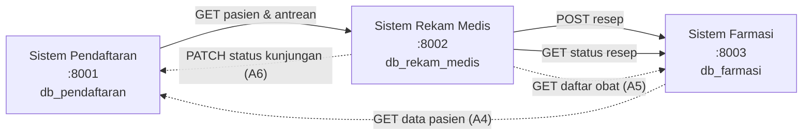
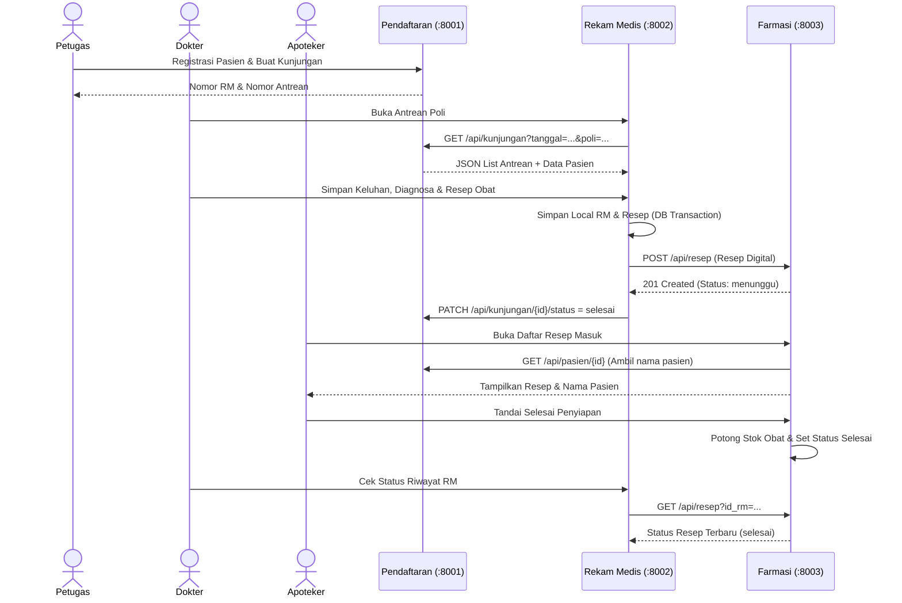

# Dokumentasi Arsitektur Sistem Mini Hospital EAI

## 1. Diagram Konteks (Context Diagram)

---

## 2. Diagram Komponen Architecture

Setiap aplikasi mengadopsi arsitektur terpisah **Model-View-Controller (MVC)** dengan **Repository Pattern**:

- **Core Component**: Autoloader, Router, Request, Response, Database (PDO Singleton), ErrorHandler terpusat, ApiAuth middleware (`X-API-KEY`), Csrf protection.
- **Repositories**: Mengisolasi query SQL per tabel.
- **Clients (cURL HTTP Client)**: Mengelola komunikasi server-to-server antar backend.
- **Controllers**: Menerima request HTTP (Web UI / REST API) dan memanggil repository/client.

---

## 3. Sequence Diagram Alur Utama End-to-End

---

## 4. System of Record (Sumber Kebenaran Data)

| Entitas Data | System of Record | Penjelasan |
| --- | --- | --- |
| **Pasien & Kunjungan** | Sistem Pendaftaran | Pendaftaran memegang hak tunggal pembuatan No. RM dan No. Antrean. Aplikasi lain mengambil data via API. |
| **Rekam Medis & Resep** | Sistem Rekam Medis | Tempat utama penyimpanan keluhan, diagnosa dokter, dan resep asli. |
| **Master Obat & Stok** | Sistem Farmasi | Tempat utama stok inventaris obat dan penyiapan resep. |
