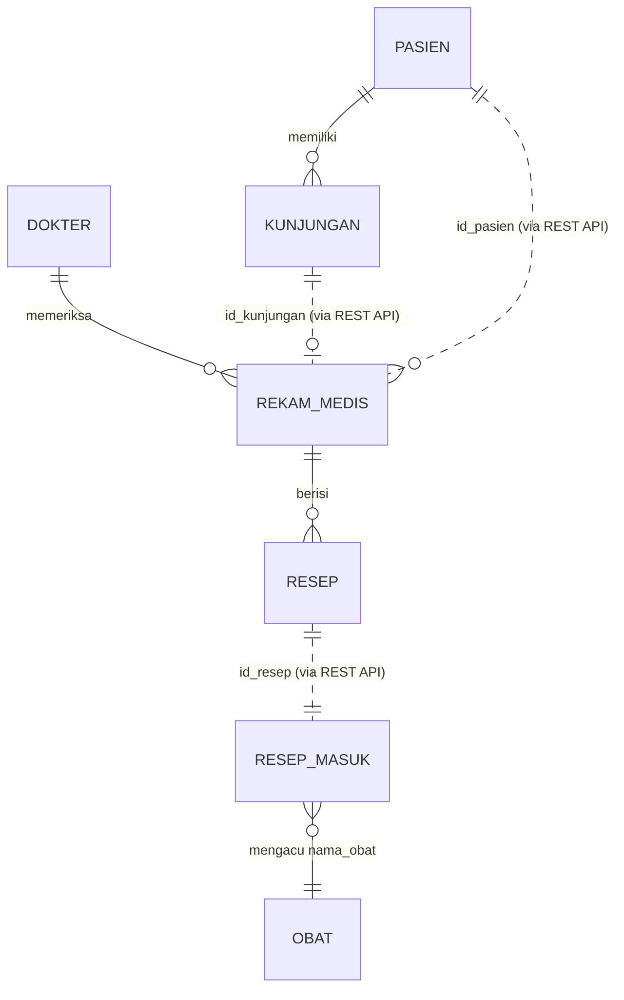

# Dokumentasi Database & Kamus Data

Setiap aplikasi mengelola database MySQL 8 terpisah. Total tabel dalam sistem adalah **7 tabel**.

---

## 1. ERD & Relasi Lintas Database

---

## 2. Kamus Data Tabel

### 2.1 Database `db_pendaftaran` (2 Tabel)
1. **`pasien`**: `id_pasien` (PK), `no_rm` (UNIQUE, format `RM-000001`), `nama`, `tgl_lahir`, `jenis_kelamin` (L/P), `alamat`, `no_hp`, `created_at`.
2. **`kunjungan`**: `id_kunjungan` (PK), `id_pasien` (FK to pasien), `tgl_kunjungan`, `poli` (Umum/Gigi/Anak), `no_antrean`, `status` (menunggu/selesai), `created_at`. UNIQUE KEY (`tgl_kunjungan`, `poli`, `no_antrean`).

### 2.2 Database `db_rekam_medis` (3 Tabel)
1. **`dokter`**: `id_dokter` (PK), `nama_dokter`, `spesialis`.
2. **`rekam_medis`**: `id_rm` (PK), `id_kunjungan` (UNIQUE, ref lintas DB), `id_pasien` (ref lintas DB), `id_dokter` (FK to dokter), `keluhan`, `diagnosa`, `tgl_periksa`.
3. **`resep`**: `id_resep` (PK), `id_rm` (FK to rekam_medis ON DELETE CASCADE), `nama_obat`, `dosis`, `jumlah`, `aturan_pakai`.

### 2.3 Database `db_farmasi` (2 Tabel)
1. **`obat`**: `id_obat` (PK), `nama_obat` (UNIQUE), `stok`, `harga`.
2. **`resep_masuk`**: `id_resep_masuk` (PK), `id_resep` (UNIQUE, idempotensi), `id_rm`, `id_pasien`, `nama_obat`, `dosis`, `jumlah`, `aturan_pakai`, `status` (menunggu/selesai), `tgl_masuk`, `tgl_selesai`.

---

## 3. Seed Data Default

- **`db_pendaftaran`**: 5 pasien (`RM-000001` s/d `RM-000005`), 3 kunjungan hari ini (`CURDATE()`).
- **`db_rekam_medis`**: 3 dokter (`dr. H. Ahmad Dahlan`, `drg. Anisa Rahma`, `dr. Budi Setiawan, Sp.A`).
- **`db_farmasi`**: 10 master obat (`Paracetamol 500 mg`, `Amoxicillin 500 mg`, `Cetirizine 10 mg`, `Ibuprofen 400 mg`, `Antasida Doen`, `Vitamin C 500 mg`, `Ambroxol 30 mg`, `Omeprazole 20 mg`, `Oralit / ORS`, `Chlorhexidine Mouthwash`), stok 20-200.
